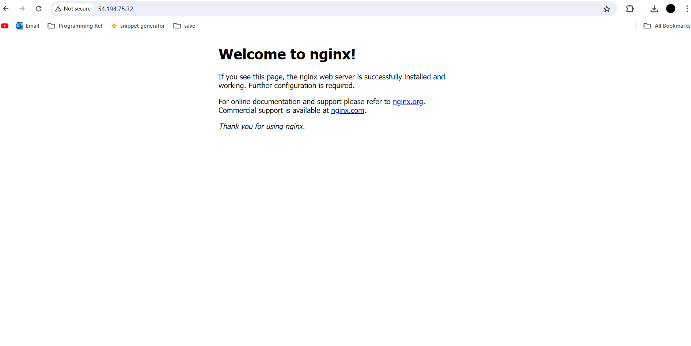

# Deploying a virtual machine on AWS

## 1. Log into AWS and go to EC2

AWS (Amazon Web Services) is a cloud provider that offers cloud computing services. One such service is EC2, or Elastic Compute Cloud. It essentially allows you to rent a computer from Amazons servers and perform tasks using their hardware instead of your own. These computers are known generally as 'virtual machines' which perform 'virtulisation' to emulate computer systems. AWS calls virtual machines 'instances'.


- To create an EC2 instance, first go to your AWS account and search for EC2.


## 2. Press 'Launch instance'


## 3. Fill in the necessary information

- Name your EC2 instance (use a suitable naming convention)
- Choose the OS image

    An OS image is a file (ending in `.iso`) that contains a pre configured operating system that we can load to boot into an OS. Think of it like a snapshot, where when we load it, the system loads an OS with the exact state the snapshot was taken (the OS image was created)
  
    - For each OS image, there is many Amazon machine images (AMIs). Choose the AMI, ensuring you only get what is necessary as it can get expensive. If a free tier is available, try to go for that one


- Choose the instance type. Different types provide different hardware and prices, with more expensive ones having more memory and CPU. Again, only get what is necessary and aim for free tiers.


- Give a key pair to login to the instance
    - To secure our instance so that not anyone can just connect to the instance, we must create a public/private SSH key pair in order to authenticate users. The keys are files which have the same name with the private key typically ending in `.pem`, with the public key thought of as the lock to our instance and the private key being the key to unlock it. Ensure the private key is ONLY in your `.ssh/` folder to maximise security. 


- Edit the network settings
    - explain security groups and ports
    - We can secure our instance using security groups. Security groups are essentially firewalls and we can set up rules so that only specified traffic is allowed to connect with your instance. For each rule, you can specify what kind of traffic (e.g. SSH, HTTP,...) is allowed over a given port. A port is essentially the entry point to your system, and is a number that you specify at the end of the IP when connecting. Only the specified traffic given in the rule will be allowed through the port. 
    - Some traffic can only go over a certain port. For example, HTTP traffic can only go over port 80, and with AWS this is by default.


- Edit the security groups, and add a rule for HTTP
    - Ensure the security groups have descriptive names and follow a suitable convention
    - We need to add a rule for HTTP so that we can access our web server from the internet


- Check your summary looks similar to the picture below. If so, launch your instance with the button.


## 4. Connect your instance


Once you press connect, navigate to SSH client. You can now open an SSH client (such as Git Bash), and input the following commands to connect to your instance.


Your private key should ALWAYS be in your `.ssh` folder and secure from everybody


After running, you should be connected to your instance, with the username 'ubuntu'


# Setup web server 

## Install nginx

Firstly, ensure your system is fully updated by running
```
sudo apt update -y
sudo apt upgrade -y
```


Now install nginx with `sudo apt install nginx -y`


Nginx is our web server, and it should be running by default. To check it is running, run `systemctl status nginx`


Press q to quit that. We can now access our webpage by typing the IP given on our AWS instance page into the search bar.



