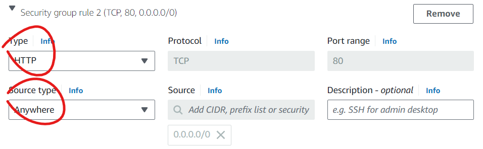

# Deploying a virtual machine on AWS

## 1. Log into AWS and go to EC2

- explain what an ec2 is


## 2. Press 'Launch instance'


## 3. Fill in the necessary information

- Name your EC2 instance (use a suitable naming convention)
- Choose the OS image
    - explain OS images
    - For each OS image, there is many Amazon machine images (AMIs). Choose the AMI, ensuring you only get what is necessary as it can get expensive. If a free tier is available, try to go for that one


- Choose the instance type. Different types provide different hardware and prices, with more expensive ones having more memory and CPU. Again, only get what is necessary and aim for free tiers.


- Give a key pair to login to the instance
    - explain ssh keys


- Edit the network settings
    - explain security groups and ports


- Edit the security groups, and add a rule for HTTP
    - Ensure the security groups have descriptive names and follow a suitable convention
    - We need to add a rule for HTTP so that we can access our web server from the internet




- Check your summary looks similar to the picture below. If so, launch your instance with the button.


## Connect your instance


Once you press connect, navigate to SSH client. You can now open an SSH client (such as Git Bash), and input the following commands to connect to your instance.


Your private key should ALWAYS be in your `.ssh` folder and secure from everybody


After running, you should be connected to your instance, with the username 'ubuntu'


## Install nginx

Firstly, ensure your system is fully updated by running
```
sudo apt update -y
sudo apt upgrade -y
```


Now install nginx with `sudo apt install nginx -y`


Nginx is our web server, and it should be running by default. To check it is running, run `systemctl status nginx`


Press q to quit that. We can now access our webpage by typing the IP given on our AWS instance page into the search bar.

