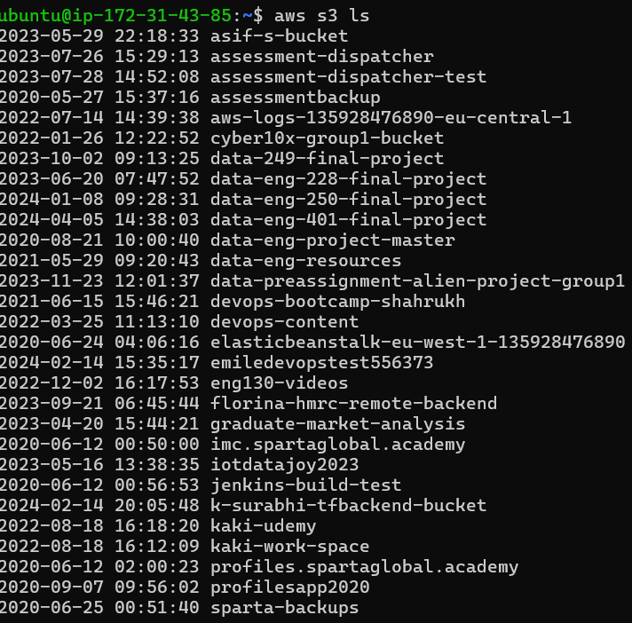

# AWS Simple Storage Service (S3)

Known as Blob storage in Azure

Used to: 
- store and retrieve data
  - buckets (in azure: containers) to store the data (blobs)
  - One bucket per S3
  - no buckets in buckets (like how u can do folders in folders - you can still upload these folders in folders to the bucket though)
  - blobs must be stored in buckets
  - **analogy**: throwing clothes on the bed rather than neatly organizing it
  - default setting: everything is private
    - if blobs is public then url/endpoint to access the blobs -> static website
    - (alot) cheaper if blobs are private
  - redundancy built in (backups of your blobs so if one goes down you can still access it)
  - Access from AWS console, AWS CLI, Python boto3
- host a static website on the cloud (using url/endpoint)
  - private by default, so ensure it is public
  - static: once the get request is made, thats what you see. the website does not change based on data it gets down the line
  - dynamic: the website changes as it gets data e.g. user input


## Create S3 buckets

1. Create a new AWS EC2 instance
   - Ubuntu 22.04
   - SSH in, then update and upgrade
   - Ensure python3 is installed: `sudo apt-get install python3` (is by default)
     - We can set an alias so you don't have to type python3 and can rename the command to e.g. python: `alias python=python3`
     - Can add to .bashrc to make it persistent
   - Ensure pip is installed: `sudo apt-get install python3-pip -y`
   - Install AWS CLI: `sudo pip install awscli`
     - check version: `aws --version` should output 1.32.97

2. Log in to your AWS account through the CLI
   - Run `aws configure`
   - Input your access key id and the secret access key
     - note do not share the secret access key! The terminal does not blank out the text so check if your sharing your screen as well.
   - default region: `eu-west-1`
   - default output formal: `json`
   - Test by running `aws s3 ls`



3. Running commands
   - use aws help to see a list of commands (q to escape)
     - aws <command> help
     - aws <command> <subcommand> help 
     - Documentation:
       - https://docs.aws.amazon.com/cli/latest/reference/s3/
       - https://docs.aws.amazon.com/cli/latest/userguide/cli-services-s3-commands.html#using-s3-commands-delete-buckets
       - https://docs.aws.amazon.com/cli/latest/reference/s3/

## CRUD

4. Create the bucket:
```bash
aws s3 mb s3://<name of bucket> --region <region e.g. us-west-1>
```
   
5. Add file to bucket:
```bash
aws s3 cp <filename> s3://<bucket name>
```
- See contents of bucket with:
```bash
aws s3 ls s3://<name of bucket>
```

6. Get contents of bucket to directory:
```bash
aws s3 sync s3://<bucket name> <directory>
```

7. Delete a single file from bucket:
```bash
 aws s3 rm s3://<bucket name>/<filename>
```

:warning: :boom: Dangerous - deletes everything without warning :boom: :warning: <br>
8. Delete all files from bucket:
```bash
aws s3 rm s3://<bucket name> --recursive
```

9. Delete bucket:
   -  cannot delete non-empty bucket!
   -  to delete non-empty, use --force 
```bash
aws s3 rb s3://<bucket name>
```
:warning: :boom: Dangerous - deletes everything without warning :boom: :warning: <br>
```bash
aws s3 rb s3://<bucket name> --force
```

## Using Python Boto3 to manage AWS S3

Python has a boto3 module which lets you create scripts to automate these actions. In this directory there is a `scripts` folder that contains python scripts for CRUD on S3. 

Install with:
```bash
pip install boto3
```

All scripts create an s3 client and specify a bucket name to work with, then calls the given function with the relevant arguments.
