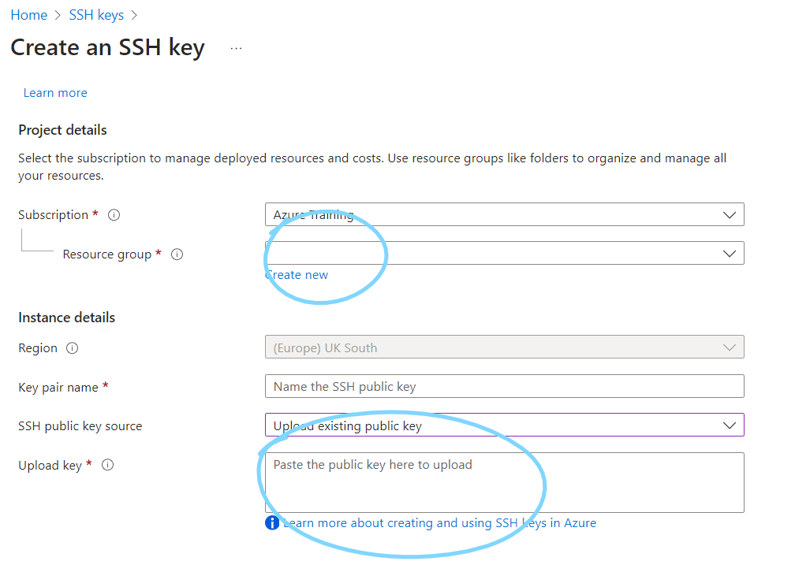
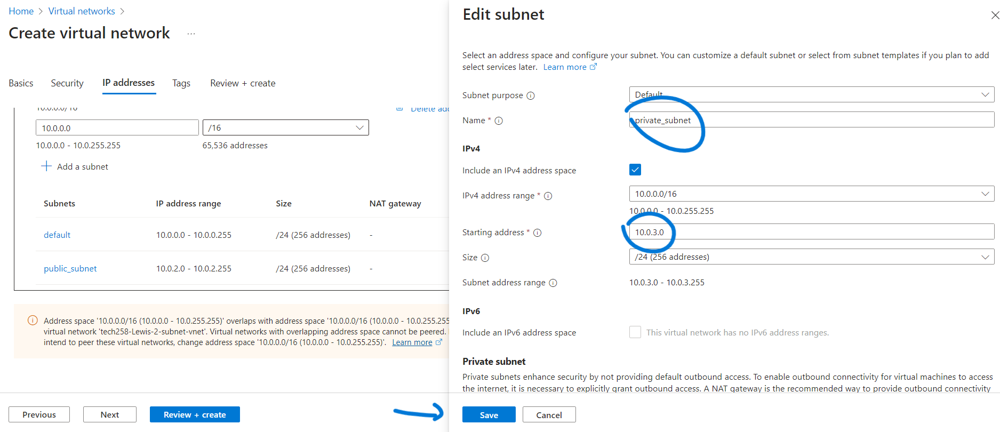
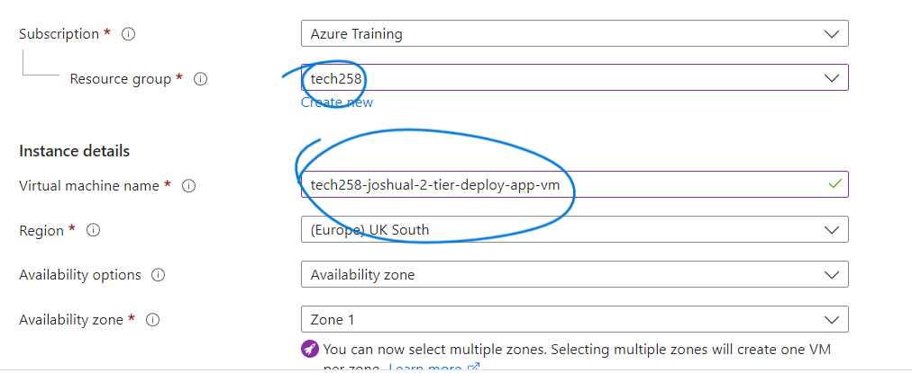
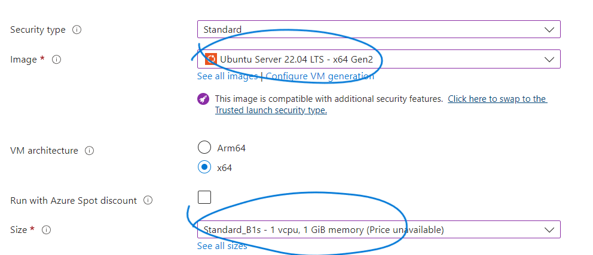
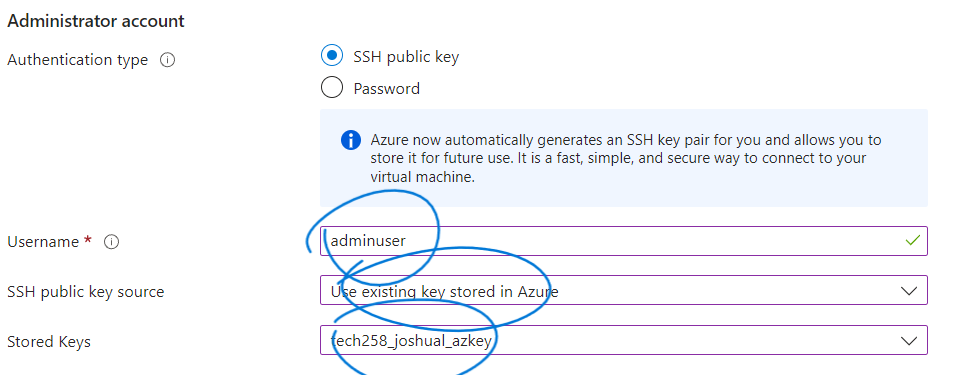
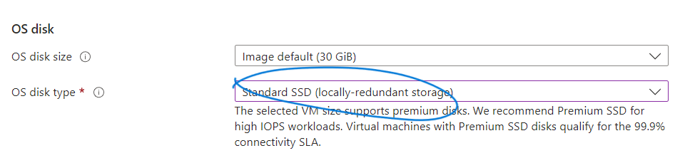
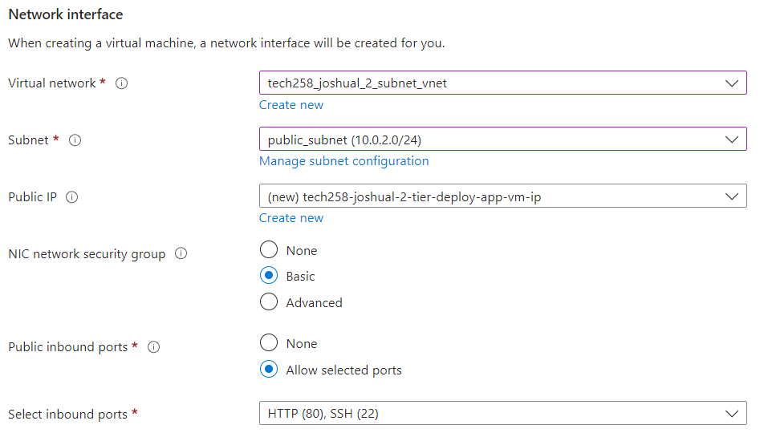
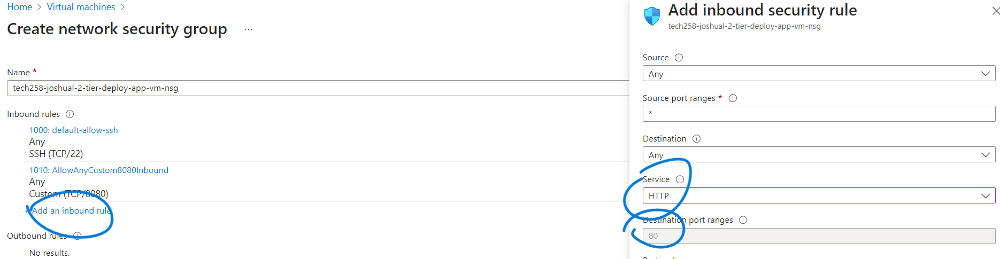
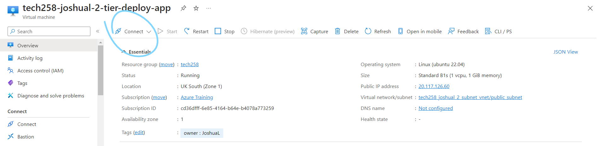
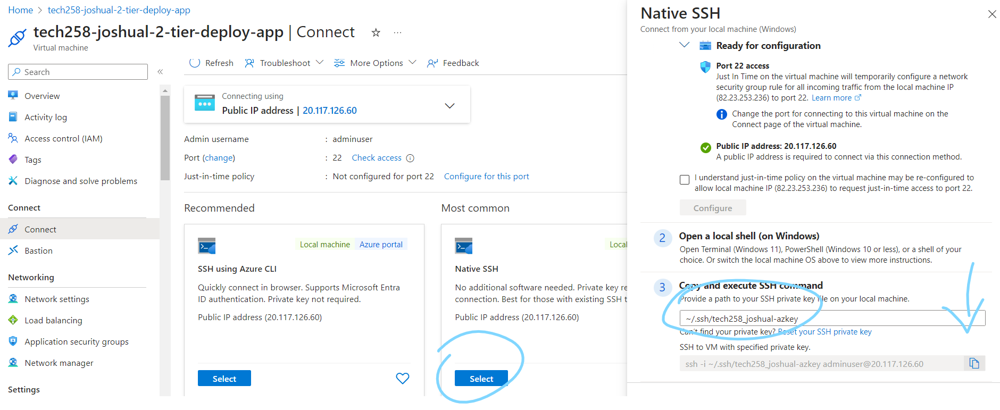

# Deploying a VM on Azure

## Login 

Firstly login to Azure through portal.azure.com

## Key pair

When creating an instance on AWS, we can create a SSH public/private key pair using `ssh-keygen`. The command is:
```bash
ssh-keygen -t rsa -b 4096 -C <email>
```
Give a suitable name, and a private and public key will be generated. We will send the public key to Azure and keep the private key for future reference to log in.

To upload the public key:
1. Use the correct resource group 
2. Select 'upload existing public key' and give it a suitable name
3. Paste your contents of your public key file that `ssh-keygen` created


## Setup VNet

In AWS, your networks are configured for you so that you can connect two instances together using their private IPs. 

In Azure we have to configure the network - the vnet - and divide our network up into subnets.

To do this, search up 'VNet' and navigate to create virtual network. Give it a suitable name and ensure there is enough space for the amount of instances you need (16 should be enough)

### Subnets

Now we need to create two subnets: one public one and one private one. The public one will be used by our app instance as we need to connect to it from the internet, and the private one will be used by the database instance. Ensure the starting addresses are different for each and save them for later



Azure will always attempt to use the first private IP available. For example, the private IP of the database will typically be 10.0.3.4

It doesn't start from 10.0.3.1 since those IP addresses are reserved for special instances.

## Setup VM 

Now we can set up our virtual machines (or in AWS EC2 instances). Search up 'VM' and create two virtual machine instances. They will be mostly the same but with some key differences.

1. Ensure you use the correct subscription and resource group (so you get access to the correct services)
2. Give the VMs suitable names (for app and db)
3. Use UK South region (as opposed to Ireland for AWS)

4. Select your image and size - here we are using Ubuntu 22.04 LTS (x64 Gen2) with standard B1s. These are cheap and suitable for testing purposes.

5. Select 'Use existing key' for SSH authentication and choose the key you uploaded earlier on.

6. Select Standard SSD for the OS disk type

7. In Networking, we need to choose the subnet we created earlier on. This is the key difference between our appplication and database VMs: choose the public subnet for the app VM and the private subnet for the db VM.
8. In the app VM, we also need to crate a new network security group. Select 'Advanced' and then click 'Create new'. 

9. Add two inbound rules: one for HTTP and one for TCP port 3000 (for node). Change the destination port target to 3000 for node. 
- For our database, we only need to allow SSH traffic so we do not need to configure this. We do not need to allow TCP port 27017 for mongodb since Azure, by default, allows all inbound traffic between instances, so port 27017 is open by default when connecting with the private IP of the database.. 

10.   Leave the other settings alone. Click create and go to the VMs on your homepage.
11.   Now connect in a similar way to AWS. You can give the path to your private key and get an easy to copy and paste command to log in.


12.  Run the scripts in the corresponding instances. The 2 tiered app is now deployed on Azure.
   
## Deleting the VM

In AWS, when we terminate our instance, it cleans up after itself. In Azure however, we need to remember to delete more things as they can cost money. Remember to delete:
- The virtual machine
- The public IP address
- The network interface

SSH keys, network security groups and virtual networks do not cost any money. As a result it is not necessary to delete these, however you can just to clean up after yourself.

You can stop a machine without deallocating (keeps cpu, memory, resources etc), and you would still be paying for the VM if so. When stopping and deallocating, you still pay some, but no where near as much. Deleting the instance removes all costs.

## Accessing the app folder

You may have access to the app folder or not depending on where the app folder was cloned to. If it was cloned to the adminuser directory, you will be able to access it but when converting to an image it will not be saved (the adminuser directory is deleted). Therefore we need to save it to a parent directory.

We would like it to be saved to `/` so that the file path is `/repo/app`. It may also be saved to `/home/root/repo/app`. We will not be able to directly access these when SSHing in as we are adminuser, not root which has elevated privilages. There are a few ways we could access the app:
- Use `sudo -E` to preserve the existing environment variables
- Log in as root with `sudo su -`
- (Recursively) Change the file permissions with `sudo chmod -R`
- (Recursively) Change the file owner with `sudo chown -R`