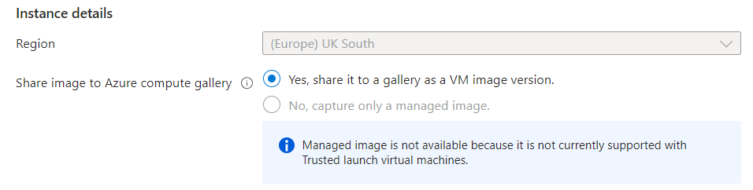

# Availability sets/zones

## Availability sets

An availability set is a logical grouping of VMs (i.e. digitally). Availability sets place VMs in different fault domains for better reliability but they are still running in the same data center.

As a result, there is not much latency between the VMs are they are physically close. They are also quite simple to set up.

However, while fault tolerant, they are not risk free. 

(if one vm is updated, only one is at that time and the others can be updated later. ensures high availability as we can do testing on that one, and the others still work with the previous code)

## Availability zones

An availability zone is a physical zone (in an Azure region; 3 per region). Each availability Zone has a distinct power source, network, and cooling, and you can assign VMs to any of them. 

This can be useful if you want to back up your data. For example, if a data center goes down, your data is still available in another zone.
- With sets, if your data center goes down, your data is lost.

However this increases complexity as you have to manage resources across multiple zones. Zones are also not available in all regions, and in this case you are forced to use a set. Zones are also physically far apart, and so there is some latency between the VMs.

