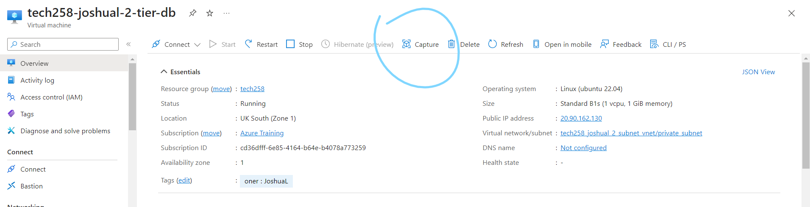
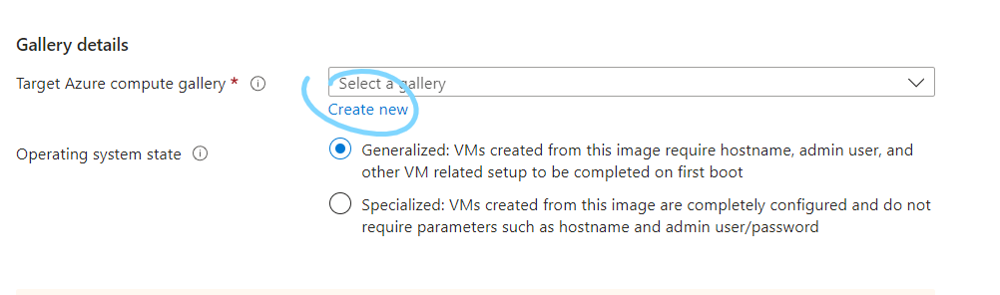
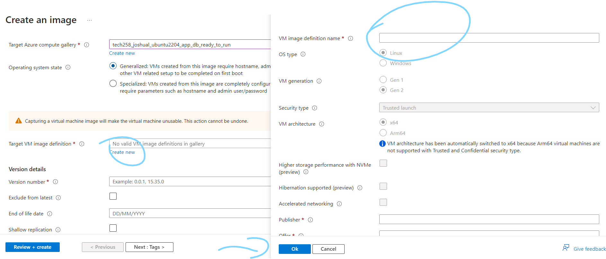
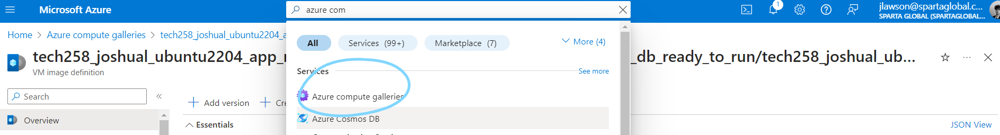
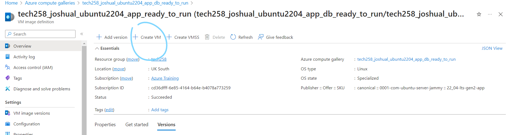
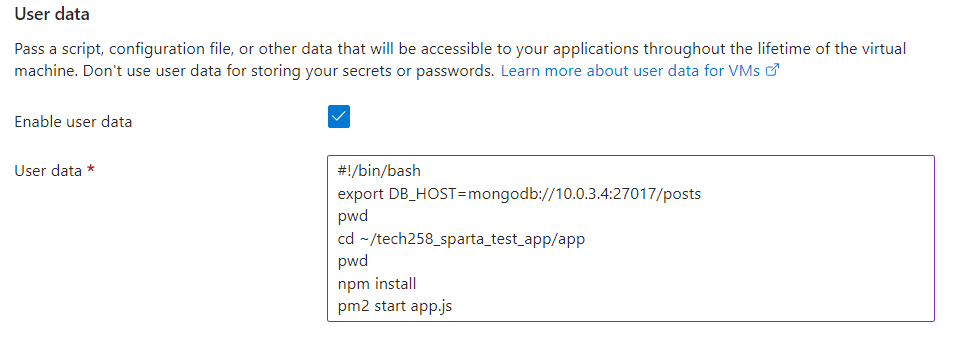

# App deployment

Speed to deploy (time taken to gain access to the app) (Slowest to fastest):
1. Manually (SSH in) - Must copy and paste and run each command
2. Scripting (SSH in) - Must copy and paste the script then run it which still runs each command
3. User data (no SSH in) - Must still run the commands
4. Image/AMI (+ a little bit of user data to make the app run automatically remember nginx is enabled but not the app itself)
   -   When using an image, since we dont have to run the commands, the app/db will actually be up faster than if you e.g. ran the script

## Manually

We ensure when writings scripts to first manually try each command first to see if we need any user inputs and if we do note down the problem, while also adding the commands that do work to the script.

## Scripting

After writing an initial script and saving it to our documentation, we deploy a fresh instance, SSH in and copy and paste the script into the new instance and run it. Once fully works with no user input, we can move on to the next step.

## User data

While creating a VM, in advanced settings we can check 'user data' and paste in our script. This automatically runs our script when deploying the app as the root user, starting from `/`, so we can run our script without having to SSH in. We may need to rewrite parts of our script to ensure it works with these points.

Remember these commands MUST start with #!/bin/bash, so the VM knows what shell to use!

## Create Image

We can then create an image, or as AWS calls it AMI, of our instance. An image is essentially a snapshot of the state of the operating system, with its current configuration, and we can load an image to bring us back to that state. This dramatically speeds up deployment time as we do not have to run any of the commands - they have already ran before we saved the image. Azure calls creating an image 'Capture'. 

You have to create a gallery where your images are stored

Now you can create the image

WARNING: Creating an image deletes the VM that was using it. However, you can quickly run it again by creating a new VM using the image. 

To use an image, go to 'Azure Compute Galleries'

Select the gallery you made and your images will be listed there. Go to the image you want to deploy and click 'Create VM' 

You will still need to input some information such as the disk space, network settings and any additional user input the instance may require, however it is considerably faster than having to run the commands.

For example, to get the posts page running, we need to set the DB_HOST environment variable, re-install the app and start it using pm2. This is because our app is not enabled, unlike the system services like e.g. Nginx. Therefore, we need to start it manually using user data.

