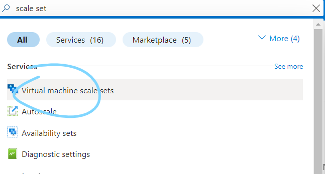

# App deployment

Speed to deploy (time taken to gain access to the app) (Slowest to fastest):
1. Manually (SSH in) - Must copy and paste and run each command
2. Scripting (SSH in) - Must copy and paste the script then run it which still runs each command
3. User data (no SSH in) - Must still run the commands
4. Image/AMI (+ a little bit of user data to make the app run automatically remember nginx is enabled but not the app itself)
   -   When using an image, since we dont have to run the commands, the app/db will actually be up faster than if you e.g. ran the script

## Manually

We ensure when writings scripts to first manually try each command first to see if we need any user inputs and if we do note down the problem, while also adding the commands that do work to the script.

## Scripting

After writing an initial script and saving it to our documentation, we deploy a fresh instance, SSH in and copy and paste the script into the new instance and run it. Once fully works with no user input, we can move on to the next step.

## User data

While creating a VM, in advanced settings we can check 'user data' and paste in our script. This automatically runs our script when deploying the app as the root user, starting from `/`, so we can run our script without having to SSH in. We may need to rewrite parts of our script to ensure it works with these points.

Remember these commands MUST start with #!/bin/bash, so the VM knows what shell to use!

We can see a log of what user data ran with:
```bash
cat /var/log/cloud-init-output.log
```

## Create Image

We can then create an image, or as AWS calls it AMI, of our instance. An image is essentially a snapshot of the state of the operating system, with its current configuration, and we can load an image to bring us back to that state. This dramatically speeds up deployment time as we do not have to run any of the commands - they have already ran before we saved the image. Azure calls creating an image 'Capture'. 


You can either create a gallery to store your images OR just save the image as a managed image

WARNING: Creating an image stops and deallocates (cpu, memory and bandwidth (resources) assigned to it) the VM that was using it. However, you can quickly run it again by creating a new VM using the image. 
   - The VM must be stopped so that we can copy the disk (remember some files cannot be accessed when running).

### Specialized vs Generalized image

Specialized: The image retains OS configurations and user accounts that existed when captured e.g. `adminuser` stays and `mongod.conf` is adjusted

Generalized: The image has no configurations or user accounts and any user could boot up the image and log in without having to provide specific information

We tend to prefer generalized images for added flexibility as we do not need to specify any specific users or related info to login - its generalized. Therefore, any user directories are deleted.
- For example, all images on the marketplace are generalized.
- Specialized images can be useful if you still need access to the e.g. `adminuser` directory
  - For us this is unecessary as we save our app to the root directory, which is still copied over.

To generalize an OS image, before capturing your VM, run:
```bash
waagent -deprovision+user
```
This removes machine-specific information and configurations such as machine IDs, network configurations, SSH host keys, user accounts so that when the image is deployed to a new virtual machine, it doesn't conflict with other machines or retain any unique identifiers from the original instance.
- `deprovision` removes the configurations, `user` removes the user accounts.


Now we can capture the image

### Create image with gallery

To create a gallery:

Now you can create the image


To use an image, go to 'Azure Compute Galleries' if using a gallery


Select the gallery you made and your images will be listed there. Go to the image you want to deploy and click 'Create VM' 


### Create managed image (without gallery)

Alternatively select 'No, create a managed image', and then you will not have to create a gallery.

If you get the following error:



You will not be able to create a managed image
   - To fix this, ensure the VM is not 'trusted launch' - a setting you change when setting up the VM


Now navigate to 'Images' and 'Create VM' for your image

And create the VM as you normally would

You will still need to input some information such as the disk space, network settings and any additional user input the instance may require, however it is considerably faster than having to run the commands.

For example, to get the posts page running, we need to set the DB_HOST environment variable, re-install the app and start it using pm2. This is because our app is not enabled, unlike the system services like e.g. Nginx. Therefore, we need to start it manually using user data.


If you did not want to posts page to work, simply do not export the DB_HOST variable, so when installing the app it cannot find the DB and so the posts page will not function correctly.

The user data code (for easy pasting):
```bash
#!/bin/bash
export DB_HOST=mongodb://10.0.3.4:27017/posts
cd /tech258_sparta_test_app/app
npm install
pm2 stop all
pm2 start app.js
```