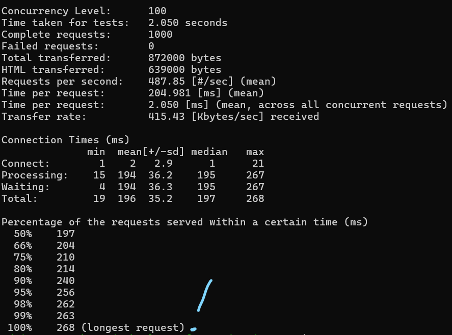

# Monitoring 

It is essential to monitor our systems to that we can see if our systems are running well 

Lets say we performed no monitoring on our app VM. If any issue were to come up e.g. the CPU load was too high, then our system would eventually break.
- We should always assume our system could run into an unforseen issue

We could implement some form of monitoring:
- Azure offers **Azure Monitor**/AWS offers **Cloud Watch**
- These display information such as CPU load to the user through a dashboard


  - This requires both a user to be watching it, and the user to be able to find the correct information in the dashboard (there could be a lot)
- We could set a threshold, that when a certain resource crosses it, an alarm goes off that notifies the user
  - This still requires a user to act on the alarm

## Auto scaling

To avoid user input, we could use **auto scaling**, where when a threshold is met, an automatic response is triggered (e.g. fire alarm goes off->sprinkler system goes off)

We want if a resource is overloaded on a VM such as CPU usage then another VM will start and traffic will be sent there instead of the overloaded VM.

Azure uses **VM Scale Sets** and AWS uses **Auto Scaling Groups**

We can scale out, or scale in

We start with our custom image created by the VM we prepared with everything to run the app.
- We used a marketplace image (ubuntu 22.04) to create the VM
- You can instead download an image from e.g. ubuntu and get a virtual hard disk file (~30GB), put it into blob storage (on Azure) and then use that to create a custom image (as a starting image - our starting image was from the marketplace) 

### VM Scale set

A VM scale set uses the final custom image + a little user data. 
- It creates our VMs.
- We need to set up policies - "custom auto scale"
  - Parameters - when will it scale?
  - E.g. if average CPU usage goes above 75%, it is time to create new VMs.
  - Also need to specify the minimum and maximum number of VMs and default (min - 2 VMS normally, max - 3 when under load, default - 2)
- The VMs as a whole would then go in the virtual network in the corresponding subnet e.g. app ones would go in public, db in private.
  - Each VM would go into a different availability zone (zone1, zone2...)


This ensures high availability and scalability (HA+SC)
- **High availability** - if one zone goes down, we use another zones VM
- **Scalability** - there is a minimum of 2 VMs and under load we can open more VMs (e.g. 3)

### Load balancer

Load balancer - decides for every request, which VM is best to send the request to
- For inbound traffic (e.g. from the internet to the app)
  - If using e.g. an intranet then the load balancer would be internal.

## Creating a dashboard

First set up a VM instance using your image

To create a dashboard, go to the 'Monitoring' tab on the instance and then click the pin on any of the charts (one you would like to track preferably)

Press 'Create new', give it a suitable name and ensure it is 'Shared', then create the dashboard.


To pin additional charts, repear but instead of 'Click new' select 'Existing' and choose the dashboard you created

To go to our dashboard, go to 'Dashboard Hub' and select your dashboard.

We can customize our dashboard by pressing edit, which allows us to drag and adjust the charts to our preference. Remember to save.


We can customize each chart by clicking it and editing what we want.
- For example, to change the time frame (default past 24 hours) go to the top right, choose the time frame then save to dashboard


Remember to save to dashboard to save the changes


## Load testing

We can now use the charts to begin load testing. Load testing is using a tool to test the limits of the resources allocated our application.
- For example, while our wep app will not be accessed by that many people, we can use a tool to send hundreds or thousands of requests to our web app and see how metrics such as CPU usage change as we recieve those requests. 
- We can use these metrics to set alerts so that if a metric goes too high, we are notified.

### Apache bench

One such load testing tool is Apache bench. Install with:

```bash
sudo apt-get install apache2-utils
```

We use apache bench with `ab`:
```bash
ab [options] [http[s]://]hostname[:port]/path
```

For example, to use apache bench to send requests to our sparta app
```bash
ab -n 1000 -c 100 http://yourwebsite.com/
```
- `-n` is the total number of requests
- `-c` is the number of requests per send (block size)
- This would send 1000 requests with 100 request blocks, so 10 sends.
- We can choose any number for n or c, but with higher numbers the command may time out as the server becomes overwhelmed.


After running and sending the requests, ab then displays useful information in the terminal about how the requests were recieved and managed



The below dashboard contains 2 major spikes in usage. The first was after sending 1000 requests and the second was after attempting to send 10000 requests (it only got to 2500~)


## Alerts

If a metric we want to track gets too high we would like to be notified. Azure uses action groups to notify all users of that group of the given alert. 
- For example, you can set up an alert to email all users of the action group when average CPU usage goes above 3%.

### Action group

To set up the action group, go to 'Monitor'->'Alerts'->'Action groups'


Create a new action group and give it a suitable name


Choose 'Email/SMS/Push/Voice', select email and give it the emails of the people to add to the action group.


Tags then review and create.

### Alert rule

Now create the rule to alert the members of the action group.

Go to the VM you are monitoring, and on the sidebar go to 'Alerts', then 'Create' and choose 'Alert rule'.


Select the condition (e.g. Percentage CPU) and provide the logic. 


It is very customizable, so the option below alerts when the average CPU usage over the past 5 minutes is greater than 5%, checking every minute. 


Select who to notify (the action group we made)


Choose what to include in the email


Now send the requests using apache bench and check if an email is sent.

Once the email is recieved remember to delete action rule and action group and dashboard.

## Create a VM Scale set on Azure
