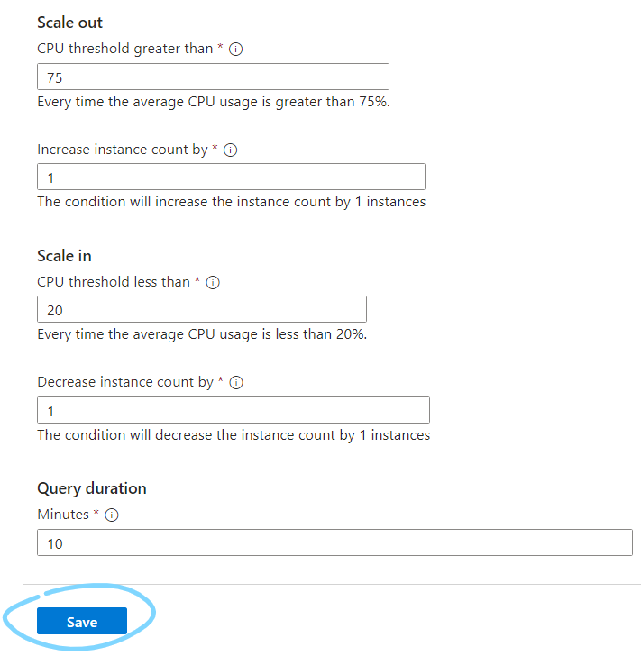

# Monitoring 

It is essential to monitor our systems to that we can see if our systems are running well 

Lets say we performed no monitoring on our app VM. If any issue were to come up e.g. the CPU load was too high, then our system would eventually break.
- We should always assume our system could run into an unforseen issue

We could implement some form of monitoring:
- Azure offers **Azure Monitor**/AWS offers **Cloud Watch**
- These display information such as CPU load to the user through a dashboard


  - This requires both a user to be watching it, and the user to be able to find the correct information in the dashboard (there could be a lot)
- We could set a threshold, that when a certain resource crosses it, an alarm goes off that notifies the user
  - This still requires a user to act on the alarm

## Auto scaling

To avoid user input, we could use **auto scaling**, where when a threshold is met, an automatic response is triggered (e.g. fire alarm goes off->sprinkler system goes off)

Azure uses **VM Scale Sets** and AWS uses **Auto Scaling Groups**

We can scale out, or scale in

## Creating a dashboard

First set up a VM instance using your image

To create a dashboard, go to the 'Monitoring' tab on the instance and then click the pin on any of the charts (one you would like to track preferably)

Press 'Create new', give it a suitable name and ensure it is 'Shared', then create the dashboard.


To pin additional charts...

To go to our dashboard...

We can customize our dashboard by... (edit->drag,readjust->save)




We can customize each chart by clicking it and editing what we want.
- For example, to change the time frame (default past 24 hours) go to the top right, choose the time frame then save to dashboard


Remember to save to dashboard to save the changes


## Load testing

We can now use the charts to begin load testing


### Apache bench

tool: apache bench

```bash
sudo apt-get install apache2-utils
```

We use apache bench with `ab`:
```bash
ab [options] [http[s]://]hostname[:port]/path
```

For example, to use apache bench to send requests to our sparta app
```bash
ab -n 1000 -c 100 http://yourwebsite.com/
```
- `-n` is the total number of requests
- `-c` is the number of requests per send (block size)
- This would send 1000 requests with 100 request blocks, so 10 sends.
- We can choose any number for n or c, but with higher numbers the command may time out


After running and sending the requests, ab then displays useful information in the terminal about how the requests were recieved and managed


# action group


Tags then review and create


now do ab requests to check if an email is sent

once email recieved, delete action rule and action group and dashboard