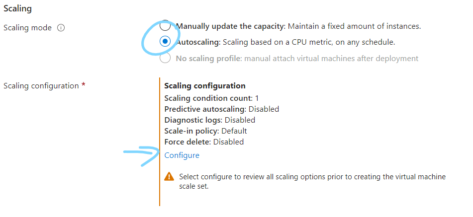
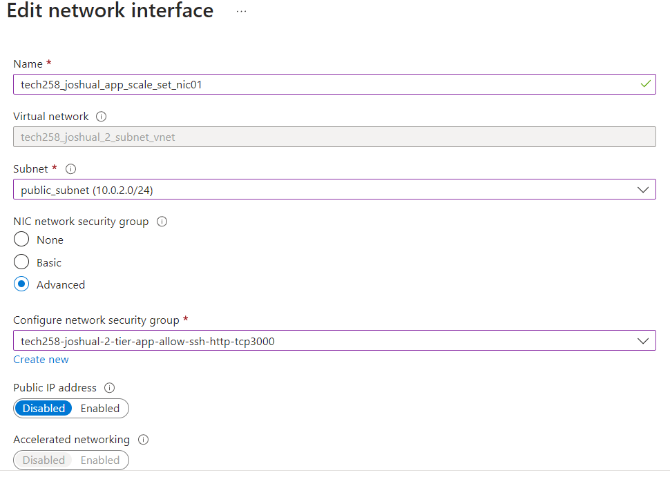
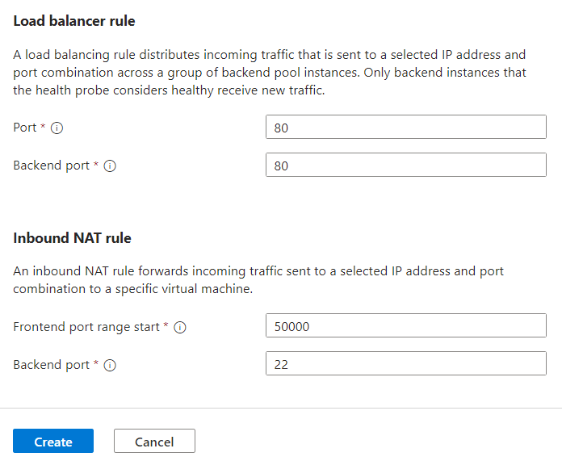

# Monitoring 

It is essential to monitor our systems to that we can see if our systems are running well 

Lets say we performed no monitoring on our app VM. If any issue were to come up e.g. the CPU load was too high, then our system would eventually break.
- We should always assume our system could run into an unforseen issue

We could implement some form of monitoring:
- Azure offers **Azure Monitor**/AWS offers **Cloud Watch**
- These display information such as CPU load to the user through a dashboard


  - This requires both a user to be watching it, and the user to be able to find the correct information in the dashboard (there could be a lot)
- We could set a threshold, that when a certain resource crosses it, an alarm goes off that notifies the user
  - This still requires a user to act on the alarm

## Auto scaling

To avoid user input, we could use **auto scaling**, where when a threshold is met, an automatic response is triggered (e.g. fire alarm goes off->sprinkler system goes off)

We want if a resource is overloaded on a VM such as CPU usage then another VM will start and traffic will be sent there instead of the overloaded VM.

Azure uses **VM Scale Sets** and AWS uses **Auto Scaling Groups**

We can scale out, or scale in

We start with our custom image created by the VM we prepared with everything to run the app.
- We used a marketplace image (ubuntu 22.04) to create the VM
- You can instead download an image from e.g. ubuntu and get a virtual hard disk file (~30GB), put it into blob storage (on Azure) and then use that to create a custom image (as a starting image - our starting image was from the marketplace) 

### VM Scale set

A VM scale set uses the final custom image + a little user data. 
- It creates our VMs.
- We need to set up policies - "custom auto scale"
  - Parameters - when will it scale?
  - E.g. if average CPU usage goes above 75%, it is time to create new VMs.
  - Also need to specify the minimum and maximum number of VMs and default (min - 2 VMS normally, max - 3 when under load, default/initial - 2)
- The VMs as a whole would then go in the virtual network in the corresponding subnet e.g. app ones would go in public, db in private.
  - Each VM would go into a different availability zone (zone1, zone2...)


This ensures high availability and scalability (HA+SC)
- **High availability** - if one zone goes down, we use another zones VM and we have a minimum of 2 so if one goes down another is always running
- **Scalability** - there is a minimum of 2 VMs and under load we can open more VMs (e.g. 3)

### Load balancer

Load balancer - decides for every request, which VM is best to send the request to
- For inbound traffic (e.g. from the internet to the app)
  - If using e.g. an intranet then the load balancer would be internal.

## Creating a dashboard

First set up a VM instance using your image

To create a dashboard, go to the 'Monitoring' tab on the instance and then click the pin on any of the charts (one you would like to track preferably)

Press 'Create new', give it a suitable name and ensure it is 'Shared', then create the dashboard.


To pin additional charts, repear but instead of 'Click new' select 'Existing' and choose the dashboard you created

To go to our dashboard, go to 'Dashboard Hub' and select your dashboard.

We can customize our dashboard by pressing edit, which allows us to drag and adjust the charts to our preference. Remember to save.


We can customize each chart by clicking it and editing what we want.
- For example, to change the time frame (default past 24 hours) go to the top right, choose the time frame then save to dashboard


Remember to save to dashboard to save the changes


## Load testing

We can now use the charts to begin load testing. Load testing is using a tool to test the limits of the resources allocated our application.
- For example, while our wep app will not be accessed by that many people, we can use a tool to send hundreds or thousands of requests to our web app and see how metrics such as CPU usage change as we recieve those requests. 
- We can use these metrics to set alerts so that if a metric goes too high, we are notified.

### Apache bench

One such load testing tool is Apache bench. Install with:

```bash
sudo apt-get install apache2-utils
```

We use apache bench with `ab`:
```bash
ab [options] [http[s]://]hostname[:port]/path
```

For example, to use apache bench to send requests to our sparta app
```bash
ab -n 1000 -c 100 http://yourwebsite.com/
```
- `-n` is the total number of requests
- `-c` is the number of requests per send (block size)
- This would send 1000 requests with 100 request blocks, so 10 sends.
- We can choose any number for n or c, but with higher numbers the command may time out as the server becomes overwhelmed.


After running and sending the requests, ab then displays useful information in the terminal about how the requests were recieved and managed


The below dashboard contains 2 major spikes in usage. The first was after sending 1000 requests and the second was after attempting to send 10000 requests (it only got to 2500~)


## Alerts

If a metric we want to track gets too high we would like to be notified. Azure uses action groups to notify all users of that group of the given alert. 
- For example, you can set up an alert to email all users of the action group when average CPU usage goes above 3%.

### Action group

To set up the action group, go to 'Monitor'->'Alerts'->'Action groups'


Create a new action group and give it a suitable name


Choose 'Email/SMS/Push/Voice', select email and give it the emails of the people to add to the action group.


Tags then review and create.

### Alert rule

Now create the rule to alert the members of the action group.

Go to the VM you are monitoring, and on the sidebar go to 'Alerts', then 'Create' and choose 'Alert rule'.


Select the condition (e.g. Percentage CPU) and provide the logic. 


It is very customizable, so the option below alerts when the average CPU usage over the past 5 minutes is greater than 5%, checking every minute. 


Select who to notify (the action group we made)


Choose what to include in the email


Now send the requests using apache bench and check if an email is sent.

### Clean up alerts 

Once the email is recieved remember to delete action rule, action group and dashboard.

## Create a VM Scale set on Azure

Our scale set will have 2 VMs running initially, and if average CPU usage increases that will go up to 3. If any turn unhealthy, after 10 mins it will redeploy the VM (delete the unhealthy and start a new one)

Firstly, ensure you have well tested custom image and user data, that is able to quickly load up the app.

Once that is ready, navigate to 'Virtual machine scale sets' and 'Create'


Select the availability zones the VMs will be launched in. We want our scale set to cover all 3 availability zones to ensure high availability. 


We can select flexible or uniform orchestration. In uniform, the VMs are identical and is sufficient for this task, but flexible can be used if we want the VMs created under load to e.g. have better CPUs.


Now choose scaling - when will the scale set create or destroy instances. We want autoscaling so that the instaces are scaled automatically based on the chosen metric



The chosen metric here is average CPU usage, so if in any of our instances the average CPU usage goes above 75%, it will deploy a new instance (scale out), checking every 10 mins. If the threshold goes below 20%, delete an instance if it is above the minimum number of instances (min - 2, max - 3).


Now follow a similar process to deploying a VM:
- select your custom image
- standard b1s, ssh, license type other
- skip spot (the VMs are cheaper but can dissapear if Azure needs the resources)

In networking, pick your virtual network and edit the network interface in it:
- Choose the correct subnet (public for app) and correct network security group (needs http and ssh at least for the app to work)



### Creating the load balancer

Now we need to create the load balancer which handles the incoming traffic and directs it to an appropriate healthy instance. 

The default settings are fine: 
- public as there are outbound connections (access via internet)
- TCP
- Load balancer recieves traffic from port 80. It would typically use backend port 3000 to connect to our app, but since we set up a reverse proxy we do not need to do that so leave that at 80
- for NAT, to connect to our VMs through the load balancer, it goes to port 50000 for the first vm, 50001 for the 2nd vm etc, and that redirects it to port 22 for SSHing in





In Health, ensure application health monitoring is ticked so that the scale set tests the connection to the website, and can determine whether the instances are healthy or unhealthy


Also check automatic repairs so that something wrong with the instance (it is unhealthy), it has 10m to recover before another is launched


In advanced, put in user data to set up VM as normal

Tags then review and create 

## SSH in to instances through load balancer

The load balancer has 1 public IP address that is used to connect to the instances and will send traffic to any healthy VM.

To connect to one of our instances go to connect but change the private ip given to the public ip (all the instances have the same public, just different private ones) and the port the load balancer needs for that instance (starting from 50000, then 50001. use -p to connect to a specific port):
```bash
ssh -i ~/.ssh/tech258_joshual_azkey -p 50001 adminuser@4.158.79.255
```

## Testing the scale set

You can test the scale set by going to the sidebar->operating system:
- Displays image used to create
- Shows user data used - you can modify it, then reimage or upgrade your instances to reapply the changes to user data (Cannot just restart the instances)

### Unhealthy instances

Our instances should be healthy at first. We can make an instance unhealthy by stopping and starting one, as the user data will not run so the app will not be running.
- The Health check will send a get request to the website, and if the response is not 200 (OK) then the instance will be marked as unhealthy
- After 10m (the grace period set) our scale set will remove unhealthy instances and recreate new ones if needed.

## Clean up scale set

To clean up, delete the scale set, then the load balancer then the public ip of load balancer (can't do public IP since it is associated with the load balancer itself)