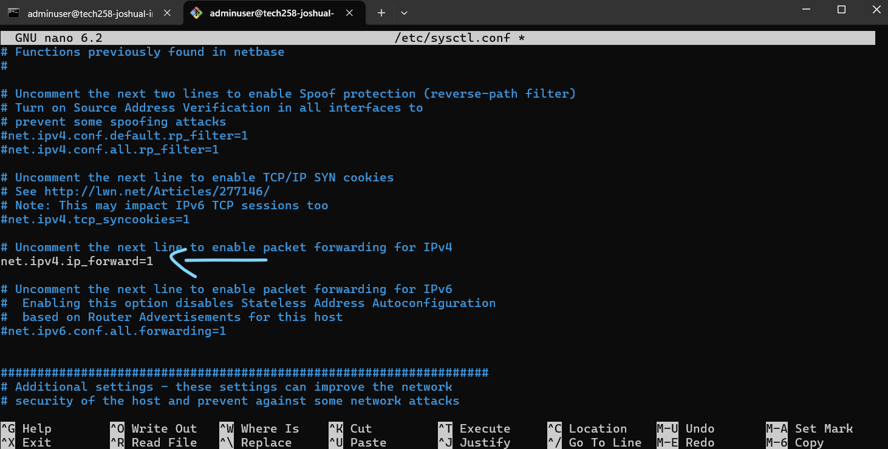

# Virtual private cloud

Goal: Use the private subnet to make the database secure

the app vm and the db vm do not talk directly, they talk through the nsgs

What we currently have:
- Our VMs are in subnets named 'public' and 'private' but they do not have any security configured on them
- We can directly ssh into the database using a public IP -> not secure!


What out goal is:
- We want to secure the database so that on the private subnet ONLY the mongodb port is allowing traffic in, and all other traffic is blocked. We may wish to also SSH in internally, but not from the outside.
- We will use a middle man to handle and filter traffic so that only mongodb traffic is allowed in - the NVA.


How paths will work:
- We configure both port rules as well as paths to the database, called 'routes'. The only route to the database should be from the public subnet
- Think of our entire virtual network as a house, and our front door is the public IP of the app. That is a valid entry point. We would not want a front door in our bedroom (the database - the private subnet)


AIM:
on the private subnet, not allow just any internal traffic, ONLY the mongodb port (27017)
- db nsg rules: allow ssh, mongodb (high priority: 100, 110)
  - deny anything else (lower priority: 1000)

We dont want to rely on just ports, but also routing (SO THAT you cant directly access the db from the outside)
- no single point of failure e.g. some admin changes a port by accident, we still have security

-> dmz (demiliterized zone) subnet as a 'middle man' between public and private subnets
- With a network virtual appliance (nva) vm - ensure db requests only go to the db, and only traffic from our public subnet is allowed to the db (basically a firewall)
- essentially force traffic to go through our nva first before going to the db, and the nva is acting as a firewall by setting rules to filter traffic 
- dmz nsg rules: allow ssh


app nsg -> nva nsg -- (forwarded,filtered trafic) --> db nsg             
- to-private-subnet route table is used to make this path
  - each step is a 'hop'

- nva nic needs ip forwarding enabled 
  - nva vm also needs ip forwarding enabled
  - nva vm use iptable rules to set firewall rules

## Making the database private

1. Create a new vnet with 3 subnets - public, dmz, private
   - for private, enable private subnet - no outbound access (so our db wouldnt be able to access the internet)
   - inbound still allowed (we could still ssh in)
   - need the custom image because we wouldnt be able to download packages etc


2. set up your db vm using the db custom image
   - in networking set public ip to 'None'

3. set up your app vm using the app custom image
   - the private ip of the db most likely changed due to changing the private subnet address space so check it before running the user data and change the export command to the new ip

4. create the nva vm
   - image: ubuntu 22.04
   - use dmz subnet and leave rest of the networking settings alone (so it has a public ip and creates a new nsg)
   - tags, review and create

5. check packet transfer between app and db using `ping`:
```bash
ping 10.0.4.4
```


6. create the route table
   1. goto route tables
   
    
    2. tag, review, create

7. add a route
   1. goto your route table, settings, route, then add
   2. put in...
   

8. associate the route table with the public subnet
   - at this point, the ping command will stop sending packets as the nva does not know how to pass the packets to the db. until we set up the rules, nothing can get to the db
   

9. enable ip forwarding on the nva nic in azure
   -  goto network settings on the sidebar


10. enable ip forwarding on the nva vm
    -  ssh in the nva vm
    -  check if ip forwarding is enabled with sysctl:
    -  uncomment the line in systctl.conf to enable ip forwarding (must also reload the rules)
    -  the packets will now be sent again to the db
```bash
sysctl net.ipv4.ip_forward
```
```bash
sudo nano /etc/sysctl.conf
```
```bash
sudo sysctl -p
```


11. all our nva does now is forward the traffic from the app to the db. now we want to filter the traffic - use iptables!
    -  note! be careful - the wrong rule loaded at the wrong time could lock you out of the instance
    -  create a script called `config-ip-tables.sh`
    -  run the script (linked in folder, update and upgrade in the script)
  
12. set stricter rules in the db nsg 
    - allow ssh (highest prio e.g. 100), mongodb (high prio e.g. 110), deny everything else (low prio e.g. 300)  


13. restrict bind ip (remember in mongod.conf we allowed 0.0.0.0 we only want to allow from ip from app vm)
    1.  we cant ssh into db (no public ip), we could ssh into a vm then from there ssh into the db

### Clean up
delete 3 vms, vnet, routes, route tables etc
- to delete the route table you need to delete the route

