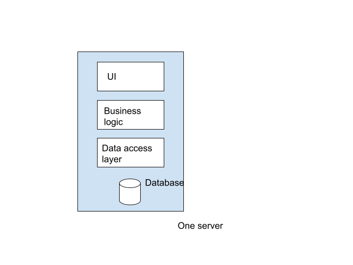

# Architecture

## Monolith

In a monolithic architecture, everything related to the application runs on 1 server. While easier to implement, there many disadvantages to the monolithic approach:
- Could be slow
- Bottlenecks in certain systems
- Difficult to scale
- Security concerns
- If the server goes down, everything goes down

## 2-tiered architecture

In a two tiered architecture, there are 2 seperate machines running the required software. For example, one runs the application on its own tier, and the other runs the database. This avoids many of the issues of monolithic architecture.

## N-tiered architecture

We can extend this idea to N servers, increasing the complexity but also allowing for more flexibility and scalability. 
