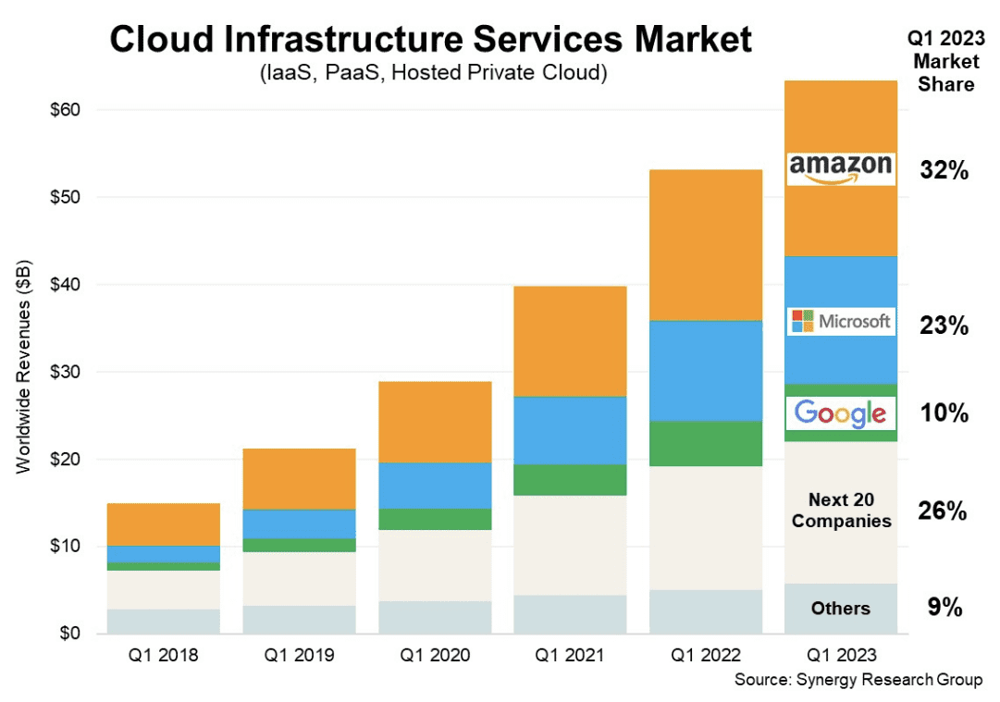
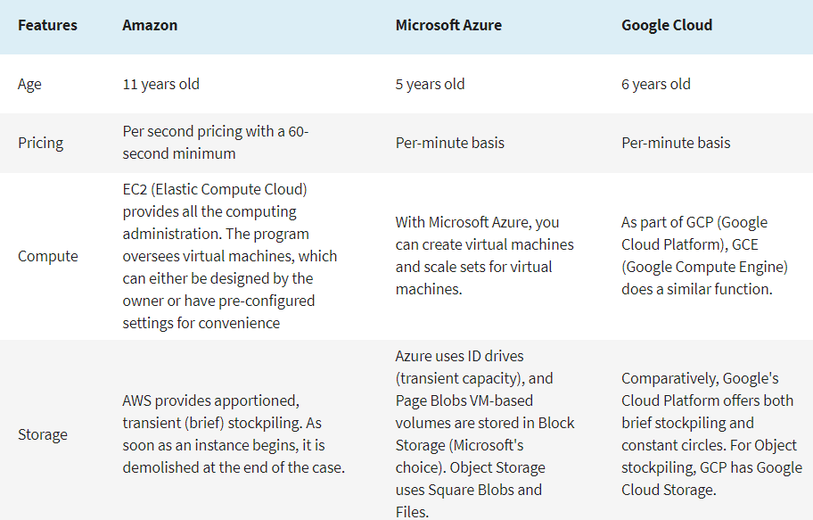

# Cloud computing

## What is Cloud computing?

Cloud computing is using other people's computers in order to do computing tasks or store data. The computers, known as 'the cloud' are networks of computers that would allow you to access more resources than you typically would have access to yourself on e.g. your laptop.

For example, if a program would take a long time to execute, you could send a request to the cloud to execute that program and return the result to you, dramatically reducing the time it takes for you to get the result. This could be provided by a cloud provider e.g. AWS, but it comes with a monetary cost.  

## On-prem vs Cloud

On-prem, or on-premises, is executing the tasks using devices physically located near you e.g. laptops, servers. With cloud, you are using remote data centres managed by cloud providers.

On-prem is a viable solution if the hardware you have access to is sufficient for the task at hand. You also do not have to pay a cloud provider to use their services, which can reduce business costs.

However, cloud comes with many of it's own advantages:
- You do not have to pay the initial cost for the hardware which can be expensive
- Cloud providers offer their own services, so you do not have to reimplement them yourself which reduces development time
- You do not have to maintain the infrastructure or services as the cloud provider handles that as well as security.

If the resources available to you on-premises is greater than the ones the cloud providers have, or the cost charged by them is not feasible, then on premises is a viable solution. However, many businesses have adopted the cloud to reduce development time and costs. The ideal solution comes on a case by case basis, so business must do their research before adopting a style.

Importantly, though, since you are essentially 'renting' the services, you must trust the provider you choose. They have full access to your data so, while big providers are unlikely to do this, they could steal your data. 

## Deployment models

1. **Public Cloud** - e.g.AWS. Cloud providers rent out their computing resources, like servers, storage, and applications, to various organizations, ensuring on demand availability to anyone who wants to use or purchase them.

2. **Private cloud** - The infrastructure is dedicated to a single organization. The software and applications in a private cloud are usually proprietary platforms tailored to meet the needs of the business. Private cloud architecture can be hosted and managed either internally by on-site staff or externally by a third-party service provider. However it is generally more costly for business owners to support their private cloud as they are responsible for setup and maintenance.
3. **Hybrid cloud** The infrastructure combines elements from private and public deployments allowing data and applications to be shared between them while offering the robust security of a private cloud and the additional storage and cost-effectiveness of a public cloud. However, the infrastructure is complex and requires highly technical expertise to install, manage, and maintain due to the evolving mix of public and private clouds.
4. **Community cloud** The infrastructure is shared by businesses with common operational and regulatory concerns, such as trade associations, non-profits, and government agencies. It is ideal for organizations that need a cost-effective way to collaborate on joint projects, applications, or research. Community clouds are cheaper than private clouds since the operating and maintenance costs are divided among the businesses. This model is hosted either on-site or off-site and owned by one or more organizations in the community or by a cloud provider.

## Types of cloud services

### Infrastructure as a Service (IaaS)

IaaS provides the infrastructure to users, including computers (virtual or on dedicated hardware), data storage as well as networking features. It can be thought of as renting hardware on the cloud, and you can do whatever you want with that hardware.

### Platform as a Service (Paas)

PaaS provides a complete development and deployment environment so that you can focus on developing applications. The infrastructure is already managed for you so all you have to manage is the applications which makes things a lot easier for developers and reduces development time. 

### Software as a Service (Saas)

SaaS provides a complete end product that you can implement into your own software without having to code it (reinvent the wheel). For example, you could buy a secure login service without having to code it and implement it into your own larger program so that you can focus on developing the actual program which reduces development time. 

## OpEx vs CapEx

CapEx, or capital expenditures, are a company's major, long-term expenses. For example, this could be the cost of physical assets such as an office space, hardware or company vehicles. It is typically a large upfront cost with little maintenance costs, such as fixing faulty servers.

OpEx, or operating expenses, are a company's day-to-day expenses. For example, this could be employee wages, rent for the office space and property taxes. These are required to keep the organization running.

In the context of the cloud, buying infrastructure for e.g. an on-prem data center would  be considered CapEx as it is a large one-time purchase for a fixed asset. On the other hand, cloud can be OpEx when costs are tied to day-to-day operations, like a monthly cloud-based application subscription for an IaaS server. 

## Migrating to the cloud

CLoud migration is the process of moving applications and data from on-prem severs to a cloud providers servers. There are many different strategies to migration as you may not want to migrate all of your data for various reasons.

- **Datacenter migration** 
Moving data from on-prem data servers to cloud provider's data servers. High-capacity networks are the most common way to move datacenter resources to the cloud, but when a powerful network isn't available, the resources can still be migrated by first moving them onto high-capacity disks and "data boxes" and then physically shipped to the cloud provider and uploaded to their servers.
- **Hybrid cloud migration** 
Moving some data from on-prem data servers to cloud provider's data servers, creating a 'hybrid cloud'. Hybrid cloud benefits include maximizing the value of existing on-prem hardware while still utilising the benefits of the cloud.
- **Cloud to cloud migration** 
Many organizations use multiple clouds so they can move resources between their public clouds using cloud to cloud migration. This type of migration is useful when an organization wants to take advantage of different cloud platforms' products, services and pricing.

## Cloud marketshare

Anybody could set up a cloud provider, however there are huge cloud providers that have so many resources that it is difficult to compete with them. There are 3 of these providers: AWS, Microsoft and Google, that take up over 50% of cloud market share globally. 

Cloud usage has increased dramatically over the last few years, and with that these companies revenues have been increasing. As a result, they are able to invest in more hardware and resources, which makes them more preferable to use (faster and more use cases) and so it creates a positive feedback loop which has created the current situation with these 3 companies completely dominating the market.

The following table outlines the key differences between the 3, and each provider offers specific products that the others may not:

- **AWS** provides the most services, however there are few hybrid cloud solutions
- **Azure** provides hybrid cloud strategies and works well with Microsoft products, and tends to be cheaper, but is specifically designed for business customers
- **Google cloud** works well with google products, but has fewer use cases compared to the other two

## Pillars of DevOps

To effectively implement DevOps, there are 4 'pillars' that must be taken into account:

1. **Communication**
2. **Collaboration**
3. **Automation**
4. **Monitoring**

