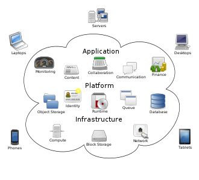

# Cloud computing

## What is Cloud computing?

Cloud computing is using other people's computers in order to do computing tasks or store data. The computers, known as 'the cloud' are networks of computers that would allow you to access more resources than you typically would have access to yourself on e.g. your laptop.

For example, if a program would take a long time to execute, you could send a request to the cloud to execute that program and return the result to you, dramatically reducing the time it takes for you to get the result. This could be provided by a cloud provider e.g. AWS, but it comes with a monetary cost.  

## On-prem vs Cloud

On-prem, or on-premises, is executing the tasks using devices physically located near you e.g. laptops, servers. With cloud, you are using remote data centres managed by cloud providers.

If the resources available to you on-premises is greater than the ones the cloud providers have, or the cost charged by them is not feasible, then on premises is a viable solution. However, not everyone has access to expensive hardware, and the cloud allows businesses to 

## Deployment models

1. **Public Cloud** - The infrastructure is entirely owned, managed, and maintained off-site via the internet by third-party service providers such as Amazon, Microsoft, or Google. With a public cloud, service providers rent out their computing resources, like servers, storage, and applications, to various organizations, ensuring availability to anyone who wants to use or purchase them.
2. **Private cloud** - The infrastructure is dedicated to a single organization or enterprise. The software and applications in a private cloud are usually proprietary platforms tailored to meet the needs of the business. Private cloud architecture can be hosted and managed either internally by on-site staff or externally by a third-party service provider. It’s generally more costly for business owners to support their private cloud as they are responsible for setup and maintenance.
3. **Hybrid cloud** The infrastructure combines elements from private and public deployments, offering the robust security of a private cloud and the additional storage and cost-effectiveness of a public cloud. However, infrastructure is complex and requires highly technical expertise to install, manage, and maintain due to the evolving mix of public and private clouds.
4. **Community cloud** The infrastructure is shared by enterprises with common operational and regulatory concerns, such as trade associations, non-profits, and government agencies. A community cloud is a suitable deployment option for organizations that need a cost-effective way to collaborate on joint projects, applications, or research. Community clouds provide a cheaper alternative to private clouds since the operating and maintenance costs are divided among the cloud tenants. This model is hosted either on-site or off-site and owned by one or more organizations in the community or by a cloud services provider.
